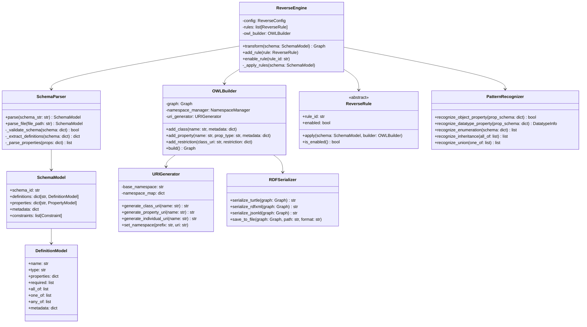

# JSON Schema → OWL2 Reverse Transformation Engine Architecture

## Executive Summary

This document outlines the architecture for a reverse transformation engine that converts JSON Schema documents back into OWL2 ontologies. The design mirrors the existing [`owl2jsonschema`](src/owl2jsonschema) architecture to maintain consistency and reuse proven patterns.

**Last Updated:** 2025-11-25  
**Status:** Design Phase

---

## 1. Directory Structure

```
src/jsonschema2owl/
├── __init__.py                    # Package initialization
├── parser.py                      # JSON Schema parser
├── engine.py                      # Main transformation engine
├── builder.py                     # OWL/RDF graph builder
├── model.py                       # Internal representation models
├── config.py                      # Configuration system
├── uri_generator.py               # URI generation from schema names
├── pattern_recognizer.py          # Recognize OWL patterns in JSON Schema
├── visitor.py                     # Visitor pattern base classes
├── serializer.py                  # RDF serialization (Turtle/RDF-XML/JSON-LD)
├── cli.py                         # Command-line interface
├── utils.py                       # Utility functions
│
├── rules/                         # Reverse transformation rules
│   ├── __init__.py
│   ├── schema_rules.py           # JSON Schema → OWL class rules
│   ├── property_rules.py         # Property transformation rules
│   ├── constraint_rules.py       # Constraint → restriction rules
│   ├── composition_rules.py      # oneOf/allOf/anyOf → OWL constructs
│   └── metadata_rules.py         # Metadata → annotation rules
│
└── services/                      # Platform-agnostic services
    ├── __init__.py
    ├── reverse_transformation_service.py
    ├── validation_service.py
    └── schema_analyzer.py
```

### Integration with Existing Web App

```
src/owl2jsonschema_web/
├── api/
│   ├── transformation.py         # Existing OWL→JSON endpoints
│   └── reverse_transformation.py # NEW: JSON→OWL endpoints
│
└── templates/
    ├── index.html                # Main interface (updated)
    ├── reverse_transform.html    # NEW: Reverse transformation UI
    └── api_docs.html             # Updated with new endpoints
```

---

## 2. Class Diagram



---

## 3. Module Responsibilities

### 3.1 `parser.py` - JSON Schema Parser

**Purpose:** Parse and validate JSON Schema documents into internal model.

**Key Responsibilities:**
- Load JSON Schema from file or string
- Validate schema against JSON Schema meta-schema
- Extract definitions, properties, and constraints
- Build internal `SchemaModel` representation
- Handle schema references (`$ref`)
- Support Draft-04, Draft-07, 2019-09, 2020-12

**Key Methods:**
```python
def parse(schema_str: str, validate: bool = True) -> SchemaModel
def parse_file(file_path: str) -> SchemaModel
def resolve_references(schema: dict) -> dict
```

### 3.2 `engine.py` - Reverse Transformation Engine

**Purpose:** Coordinate the reverse transformation process.

**Key Responsibilities:**
- Manage transformation rules
- Apply rules in correct order
- Handle dependencies between rules
- Coordinate schema → RDF graph conversion
- Track transformation metadata

**Key Methods:**
```python
def transform(schema: SchemaModel) -> Graph
def add_rule(rule: ReverseRule)
def set_namespace(prefix: str, uri: str)
```

### 3.3 `builder.py` - OWL/RDF Graph Builder

**Purpose:** Construct RDF graph representing OWL ontology.

**Key Responsibilities:**
- Create OWL classes from schema definitions
- Generate object/datatype properties
- Build restrictions and cardinality constraints
- Handle class hierarchies (rdfs:subClassOf)
- Create individuals for enum values
- Manage namespaces and URIs
- Add annotations from metadata

**Key Methods:**
```python
def add_class(name: str, parent: str = None, **metadata)
def add_object_property(name: str, domain: str, range: str, **constraints)
def add_datatype_property(name: str, domain: str, datatype: str, **constraints)
def add_cardinality_restriction(class_uri: str, property_uri: str, min: int, max: int)
def build() -> Graph
```

### 3.4 `pattern_recognizer.py` - Pattern Recognition

**Purpose:** Identify OWL patterns in JSON Schema constructs.

**Key Responsibilities:**
- Detect object property patterns (`oneOf` with `@id`)
- Recognize datatype properties
- Identify enumerations (closed vs open)
- Detect inheritance patterns (`allOf`)
- Recognize union types (`oneOf`, `anyOf`)
- Identify cardinality constraints (array minItems/maxItems)
- Detect value restrictions

**Key Methods:**
```python
def is_object_property(property_schema: dict) -> bool
def extract_range_from_ref(ref_schema: dict) -> str
def is_enumeration(schema: dict) -> bool
def extract_enum_values(schema: dict) -> list
def recognize_cardinality(schema: dict) -> tuple[int, int]
```

### 3.5 `uri_generator.py` - URI Generation

**Purpose:** Generate consistent OWL URIs from schema names.

**Key Responsibilities:**
- Create URIs from definition names
- Manage base namespace
- Handle custom namespace prefixes
- Ensure URI uniqueness
- Support custom URI patterns

**Configuration Options:**
```python
base_namespace: str = "http://example.org/ontology#"
class_uri_pattern: str = "{base}{name}"
property_uri_pattern: str = "{base}{name}"
individual_uri_pattern: str = "{base}individual/{name}"
```

### 3.6 `serializer.py` - RDF Serialization

**Purpose:** Serialize RDF graph to various formats.

**Key Responsibilities:**
- Turtle serialization (human-readable)
- RDF/XML serialization (standard)
- JSON-LD serialization (web-friendly)
- Handle pretty-printing
- Namespace prefix management

### 3.7 `model.py` - Internal Models

**Purpose:** Define internal representation of parsed JSON Schema.

**Key Classes:**
```python
@dataclass
class SchemaModel:
    schema_id: str
    schema_version: str  # draft-07, 2019-09, etc.
    definitions: dict[str, DefinitionModel]
    properties: dict[str, PropertyModel]
    metadata: dict
    
@dataclass
class DefinitionModel:
    name: str
    type: str
    title: str
    description: str
    properties: dict[str, PropertyModel]
    required: list[str]
    all_of: list  # Inheritance
    one_of: list  # Unions
    any_of: list
    enum: list
    metadata: dict
    
@dataclass
class PropertyModel:
    name: str
    type: str | list[str]
    ref: str  # For $ref
    items: dict  # For arrays
    min_items: int
    max_items: int
    required: bool
    metadata: dict
```

---

## 4. Transformation Pipeline

### 4.1 Pipeline Overview

```
JSON Schema Input
       ↓
┌──────────────────┐
│  Parse & Validate│  ← parser.py
└──────────────────┘
       ↓
┌──────────────────┐
│  Pattern Analysis│  ← pattern_recognizer.py
└──────────────────┘
       ↓
┌──────────────────┐
│   Apply Rules    │  ← engine.py + rules/*
└──────────────────┘
       ↓
┌──────────────────┐
│   Build RDF      │  ← builder.py
└──────────────────┘
       ↓
┌──────────────────┐
│   Serialize      │  ← serializer.py
└──────────────────┘
       ↓
    OWL Output
```

### 4.2 Detailed Step-by-Step Process

**Phase 1: Parsing (parser.py)**
1. Load JSON Schema from file/string
2. Validate against meta-schema
3. Resolve all `$ref` references
4. Extract definitions into `DefinitionModel` objects
5. Parse root-level properties
6. Extract metadata (title, description, custom fields)
7. Build `SchemaModel` object

**Phase 2: Pattern Recognition (pattern_recognizer.py)**
1. Analyze each definition for OWL patterns
2. Classify properties as object/datatype properties
3. Identify enumerations and their types
4. Detect inheritance patterns in `allOf`
5. Recognize union types in `oneOf`/`anyOf`
6. Extract cardinality constraints
7. Tag patterns for rule processing

**Phase 3: Rule Application (engine.py + rules)**
1. Initialize OWL graph builder
2. Apply rules in order:
   - Schema metadata rules (ontology annotations)
   - Definition-to-class rules
   - Property rules (object/datatype)
   - Constraint rules (cardinality, value restrictions)
   - Composition rules (union, intersection)
   - Enumeration rules
3. Handle rule dependencies
4. Resolve ambiguities using configuration

**Phase 4: Graph Building (builder.py)**
1. Create OWL ontology node
2. Add ontology metadata
3. Create OWL classes
4. Create properties
5. Add restrictions
6. Create individuals (from enums)
7. Add annotations
8. Validate graph structure

**Phase 5: Serialization (serializer.py)**
1. Select output format
2. Configure namespaces
3. Apply pretty-printing
4. Serialize to string or file

---

## 5. Rule System Design

### 5.1 Rule Categories

#### **schema_rules.py** - Schema-Level Transformations

**DefinitionToClassRule**
- Convert each JSON Schema definition → OWL class
- Map `title` → rdfs:label
- Map `description` → rdfs:comment
- Generate class URI from definition name

**SchemaMetadataRule**
- Map schema `$id` → ontology URI
- Map schema `title` → ontology label
- Extract custom metadata fields (`x-*`, `$metadata`)
- Create ontology annotations

#### **property_rules.py** - Property Transformations

**ObjectPropertyRule**
- Detect object properties (oneOf with `$ref` and `@id` pattern)
- Extract domain from containing class
- Extract range from `$ref` or oneOf options
- Handle functional properties (non-array)

**DatatypePropertyRule**
- Detect datatype properties (type: string, number, boolean, etc.)
- Map JSON Schema types → XSD datatypes
- Extract domain and range
- Handle functional properties

**SubPropertyRule**
- Detect property hierarchies (custom extension)
- Create rdfs:subPropertyOf relationships

#### **constraint_rules.py** - Constraint Transformations

**CardinalityRule**
- Array `minItems` → owl:minCardinality
- Array `maxItems` → owl:maxCardinality
- Required property + non-array → exact 1
- Optional property → min 0
- Array without constraints → min 0, no max

**ValueRestrictionRule**
- `items.$ref` → owl:allValuesFrom
- Combined with minItems=1 → owl:someValuesFrom
- `const` → owl:hasValue

#### **composition_rules.py** - Composition Transformations

**AllOfToIntersectionRule**
- `allOf` with multiple `$ref` → rdfs:subClassOf multiple
- Recognize inheritance pattern vs intersection

**OneOfToUnionRule**
- `oneOf` with class references → owl:unionOf
- Handle disjoint unions

**AnyOfToUnionRule**
- Similar to oneOf but non-disjoint

**NotToComplementRule**  
- `not` constraint → owl:complementOf

#### **metadata_rules.py** - Metadata & Annotations

**EnumerationRule**
- `enum` values → owl:NamedIndividual instances
- Create oneOf class restriction
- Map enum labels from `x-enum-labels`

**AnnotationRule**
- Custom properties (`x-*`) → OWL annotations
- Preserve provenance information

### 5.2 Rule Structure

```python
class ReverseRule(ABC):
    """Base class for reverse transformation rules."""
    
    def __init__(self, rule_id: str, config: dict = None):
        self.rule_id = rule_id
        self.config = config or {}
        self.enabled = True
    
    @abstractmethod
    def applies_to(self, element: Any) -> bool:
        """Check if rule applies to this element."""
        pass
    
    @abstractmethod
    def apply(self, element: Any, builder: OWLBuilder) -> None:
        """Apply transformation rule."""
        pass
    
    def get_priority(self) -> int:
        """Return rule priority (lower = earlier)."""
        return 100
```

### 5.3 Rule Ordering

Rules are applied in priority order:
1. **Metadata rules** (priority 10) - Set up ontology
2. **Definition rules** (priority 20) - Create classes
3. **Property rules** (priority 30) - Create properties
4. **Constraint rules** (priority 40) - Add restrictions
5. **Composition rules** (priority 50) - Handle allOf/oneOf
6. **Enumeration rules** (priority 60) - Create individuals

---

## 6. Configuration System

### 6.1 Configuration Structure

```python
class ReverseTransformationConfig:
    """Configuration for JSON Schema → OWL transformation."""
    
    def __init__(self, config: dict = None):
        self.config = config or self._get_default_config()
    
    @staticmethod
    def _get_default_config() -> dict:
        return {
            "namespace": {
                "base": "http://example.org/ontology#",
                "prefixes": {
                    "owl": "http://www.w3.org/2002/07/owl#",
                    "rdf": "http://www.w3.org/1999/02/22-rdf-syntax-ns#",
                    "rdfs": "http://www.w3.org/2000/01/rdf-schema#",
                    "xsd": "http://www.w3.org/2001/XMLSchema#"
                }
            },
            "uri_generation": {
                "class_pattern": "{base}{name}",
                "property_pattern": "{base}{name}",
                "individual_pattern": "{base}individual/{name}"
            },
            "ambiguity_resolution": {
                "array_handling": "non_functional_property",  # vs "rdf_list"
                "allof_interpretation": "inheritance",  # vs "intersection"
                "oneof_interpretation": "union"  # vs "disjoint_union"
            },
            "rules": {
                "definition_to_class": {"enabled": True},
                "object_property": {"enabled": True},
                "datatype_property": {"enabled": True},
                "cardinality": {"enabled": True},
                "value_restriction": {"enabled": True},
                "allof_to_intersection": {"enabled": True},
                "oneof_to_union": {"enabled": True},
                "enumeration": {"enabled": True},
                "schema_metadata": {"enabled": True}
            },
            "output": {
                "format": "turtle",  # turtle, rdfxml, jsonld
                "pretty_print": True,
                "include_comments": True
            },
            "validation": {
                "strict_mode": False,
                "warn_on_ambiguity": True,
                "fail_on_unsupported": False
            }
        }
```

### 6.2 Ambiguity Resolution

**Array Handling:**
- `non_functional_property`: Arrays → multi-valued properties (default)
- `rdf_list`: Arrays → rdf:List (preserves order)

**AllOf Interpretation:**
- `inheritance`: First item = parent, rest merged (default)
- `intersection`: All items → owl:intersectionOf

**OneOf Interpretation:**
- `union`: Simple owl:unionOf
- `disjoint_union`: owl:disjointUnionOf (default)

---

## 7. Web Application Integration

### 7.1 New API Endpoints

**File:** `src/owl2jsonschema_web/api/reverse_transformation.py`

```python
@api_bp.route('/reverse/transform', methods=['POST'])
def reverse_transform_single():
    """
    Transform JSON Schema to OWL ontology.
    
    Request:
    {
        "schema": {...},  // JSON Schema object
        "config": {...},  // Optional configuration
        "output_format": "turtle"  // turtle, rdfxml, jsonld
    }
    
    Response:
    {
        "success": true,
        "ontology": "...",  // Serialized OWL
        "metadata": {...}
    }
    """
```

```python
@api_bp.route('/reverse/validate', methods=['POST'])
def validate_schema():
    """
    Validate JSON Schema before transformation.
    
    Request:
    {
        "schema": {...}
    }
    
    Response:
    {
        "valid": true,
        "errors": [],
        "warnings": ["Ambiguous pattern detected..."]
    }
    """
```

```python
@api_bp.route('/reverse/preview', methods=['POST'])
def preview_transformation():
    """
    Preview transformation without full execution.
    
    Returns analysis of patterns detected.
    """
```

### 7.2 Service Integration

**File:** `src/jsonschema2owl/services/reverse_transformation_service.py`

```python
class ReverseTransformationService:
    """Service for JSON Schema → OWL transformations."""
    
    def transform_single(
        self,
        schema: dict,
        config: ReverseTransformationConfig = None,
        output_format: str = "turtle"
    ) -> ReverseTransformationResult:
        """Transform a single JSON Schema."""
    
    def validate_schema(self, schema: dict) -> ValidationResult:
        """Validate JSON Schema."""
    
    def analyze_patterns(self, schema: dict) -> AnalysisResult:
        """Analyze OWL patterns in schema."""
```

### 7.3 Web UI Updates

**New Template:** `src/owl2jsonschema_web/templates/reverse_transform.html`

Features:
- JSON Schema input (file upload or paste)
- Configuration panel
- Format selection (Turtle/RDF-XML/JSON-LD)
- Live validation
- Pattern detection preview
- Download result

**Update:** `src/owl2jsonschema_web/templates/index.html`
- Add "Reverse Transform" tab
- Bidirectional transformation switcher

---

## 8. API Design

### 8.1 RESTful Endpoints

**Base Path:** `/api/reverse`

| Endpoint | Method | Purpose |
|----------|--------|---------|
| `/transform` | POST | Transform JSON Schema to OWL |
| `/validate` | POST | Validate JSON Schema |
| `/preview` | POST | Preview transformation |
| `/config` | GET | Get default configuration |
| `/config` | POST | Save custom configuration |

### 8.2 Request/Response Formats

**Transform Request:**
```json
{
  "schema": {
    "$schema": "http://json-schema.org/draft-07/schema#",
    "definitions": {...}
  },
  "config": {
    "namespace": {
      "base": "http://example.org/ontology#"
    },
    "output": {
      "format": "turtle"
    }
  }
}
```

**Transform Response:**
```json
{
  "success": true,
  "ontology": "@prefix owl: <...> .\n...",
  "format": "turtle",
  "metadata": {
    "classes_generated": 15,
    "properties_generated": 42,
    "individuals_generated": 8,
    "warnings": [
      "Ambiguous allOf pattern in definition 'Vehicle'"
    ]
  }
}
```

---

## 9. Error Handling Strategy

### 9.1 Error Categories

**Validation Errors:**
- Invalid JSON Schema
- Unsupported schema version
- Malformed references

**Transformation Errors:**
- Unresolvable references
- Circular dependencies
- Unsupported patterns

**Configuration Errors:**
- Invalid namespace URI
- Conflicting rules

### 9.2 Error Response Format

```json
{
  "success": false,
  "error": {
    "code": "INVALID_SCHEMA",
    "message": "Schema validation failed",
    "details": {
      "path": "$.definitions.Person.properties.age",
      "reason": "Invalid type specification"
    }
  },
  "partial_result": null
}
```

### 9.3 Warning System

Non-fatal issues that don't prevent transformation:
```json
{
  "success": true,
  "ontology": "...",
  "warnings": [
    {
      "code": "AMBIGUOUS_PATTERN",
      "message": "allOf could be inheritance or intersection",
      "resolution": "Interpreted as inheritance (config default)",
      "location": "$.definitions.Vehicle"
    }
  ]
}
```

### 9.4 Fallback Strategies

**For Ambiguous Patterns:**
1. Use configuration default
2. Log warning
3. Add comment in generated OWL

**For Unsupported Features:**
1. Skip unsupported construct
2. Log warning
3. Continue transformation

---

## 10. Testing Strategy

### 10.1 Test Categories

**Unit Tests** (`tests/test_jsonschema2owl/`)
- `test_parser.py` - Schema parsing
- `test_pattern_recognizer.py` - Pattern detection
- `test_uri_generator.py` - URI generation
- `test_builder.py` - Graph building
- `test_rules/` - Individual rule tests

**Integration Tests**
- `test_reverse_pipeline.py` - Full transformation
- `test_roundtrip.py` - OWL→JSON→OWL consistency
- `test_web_integration.py` - API endpoints

**Validation Tests**
- Test against known OWL patterns
- Validate generated RDF with OWL reasoners
- Compare with reference implementations

### 10.2 Round-Trip Testing

Critical test: `OWL → JSON Schema → OWL`

```python
def test_roundtrip():
    # Start with known OWL ontology
    original_owl = load_ontology("test.owl")
    
    # Transform to JSON Schema
    schema = owl2jsonschema.transform(original_owl)
    
    # Transform back to OWL
    generated_owl = jsonschema2owl.transform(schema)
    
    # Compare graphs (isomorphism)
    assert rdf_isomorphic(original_owl, generated_owl)
```

### 10.3 Test Data

**Create test suite with:**
- Simple class definitions
- Property definitions (object/datatype)
- Cardinality restrictions
- Value restrictions
- Class hierarchies
- Union/intersection classes
- Enumerations
- Complex nested patterns

### 10.4 Performance Testing

- Schema with 100+ definitions
- Deep inheritance hierarchies
- Complex constraint combinations
- Large enum sets

---

## 11. Implementation Phases

### Phase 1: Core Infrastructure (Week 1-2)
- [x] Architecture design
- [ ] Implement `parser.py`
- [ ] Implement `model.py`
- [ ] Implement `uri_generator.py`
- [ ] Basic `builder.py`
- [ ] Basic `engine.py`

### Phase 2: Basic Rules (Week 3-4)
- [ ] DefinitionToClassRule
- [ ] DatatypePropertyRule
- [ ] ObjectPropertyRule
- [ ] SchemaMetadataRule
- [ ] Basic serialization

### Phase 3: Advanced Rules (Week 5-6)
- [ ] CardinalityRule
- [ ] ValueRestrictionRule
- [ ] AllOfToIntersectionRule
- [ ] OneOfToUnionRule
- [ ] EnumerationRule

### Phase 4: Web Integration (Week 7)
- [ ] REST API endpoints
- [ ] Web UI templates
- [ ] Service layer integration
- [ ] Error handling

### Phase 5: Testing & Validation (Week 8)
- [ ] Unit tests
- [ ] Integration tests
- [ ] Round-trip tests
- [ ] Documentation

---

## 12. Open Questions & Decisions Needed

### 12.1 Design Decisions

**Q1: How to handle array types?**
- Option A: Always non-functional properties (OWL open world)
- Option B: User configurable (non-functional vs RDF lists)
- **Decision:** Option B - Configuration-based, default to non-functional

**Q2: How to interpret allOf?**
- Option A: Always inheritance (first = parent, rest merged)
- Option B: Always intersection
- Option C: Heuristic-based detection
- **Decision:** Option C with configuration override

**Q3: How to handle custom JSON Schema extensions?**
- Option A: Ignore unknown fields
- Option B: Map to OWL annotations
- **Decision:** Option B - Preserve in annotations

**Q4: URI generation strategy?**
- Option A: Hash-based URIs
- Option B: Name-based URIs
- Option C: User-provided mapping file
- **Decision:** Option B with Option C as override

### 12.2 Future Enhancements

- Support for SHACL shapes alongside OWL
- Batch transformation of multiple schemas
- Schema composition/modularization
- Visual transformation editor
- AI-assisted pattern recognition
- Export to other formats (GraphQL, Protobuf)

---

## 13. Appendix: Transformation Examples

### Example 1: Simple Class

**Input JSON Schema:**
```json
{
  "definitions": {
    "Person": {
      "type": "object",
      "title": "Person",
      "description": "A human being",
      "properties": {
        "name": {
          "type": "string"
        },
        "age": {
          "type": "integer"
        }
      },
      "required": ["name"]
    }
  }
}
```

**Output OWL (Turtle):**
```turtle
@prefix : <http://example.org/ontology#> .
@prefix owl: <http://www.w3.org/2002/07/owl#> .
@prefix rdfs: <http://www.w3.org/2000/01/rdf-schema#> .
@prefix xsd: <http://www.w3.org/2001/XMLSchema#> .

:Person a owl:Class ;
    rdfs:label "Person" ;
    rdfs:comment "A human being" ;
    rdfs:subClassOf [
        a owl:Restriction ;
        owl:onProperty :name ;
        owl:minCardinality 1
    ] .

:name a owl:DatatypeProperty ;
    rdfs:domain :Person ;
    rdfs:range xsd:string .

:age a owl:DatatypeProperty ;
    rdfs:domain :Person ;
    rdfs:range xsd:integer .
```

### Example 2: Object Property

**Input JSON Schema:**
```json
{
  "definitions": {
    "Person": {
      "type": "object",
      "properties": {
        "employer": {
          "oneOf": [
            {"$ref": "#/definitions/Organization"},
            {
              "type": "object",
              "properties": {
                "@id": {"type": "string", "format": "uri"}
              }
            }
          ]
        }
      }
    }
  }
}
```

**Output OWL (Turtle):**
```turtle
:employer a owl:ObjectProperty ;
    rdfs:domain :Person ;
    rdfs:range :Organization .
```

### Example 3: Enumeration

**Input JSON Schema:**
```json
{
  "definitions": {
    "Color": {
      "type": "string",
      "enum": ["red", "green", "blue"]
    }
  }
}
```

**Output OWL (Turtle):**
```turtle
:Color a owl:Class ;
    owl:equivalentClass [
        a owl:Class ;
        owl:oneOf (:red :green :blue)
    ] .

:red a owl:NamedIndividual , :Color .
:green a owl:NamedIndividual , :Color .
:blue a owl:NamedIndividual , :Color .
```

---

## 14. References

- OWL 2 Web Ontology Language Primer: https://www.w3.org/TR/owl2-primer/
- JSON Schema Specification: https://json-schema.org/specification
- RDFLib Documentation: https://rdflib.readthedocs.io/
- Existing Implementation: [`src/owl2jsonschema/`](src/owl2jsonschema/)

---

**Document Version:** 1.0  
**Author:** Architecture Team  
**Review Status:** Draft - Pending Review